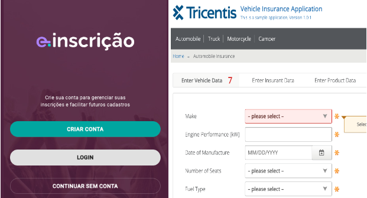

<p align="center">
 <picture>
    
  </picture> 
</p>

<h1 align="center">Teste QA 2023</h1>

---

# Indice

- [Sobre](#-sobre)
- [Tecnologias Utilizadas](#-tecnologias-utilizadas)
- [Como baixar o projeto](#-como-baixar-o-projeto)

## 🔖&nbsp; Sobre

O projeto **RocketMusic** Teste end-to-end simulando um usuário realizando inscrição em um evento utilizando a aplicação E-Inscrição. Bem como teste end-to-end simulando usuário preenchendo formulário na aplicação de seguros Tricentis.

---

## 🚀 Tecnologias utilizadas

O projeto foi desenvolvido utilizando as seguintes tecnologias

- [Cypress](https://www.cypress.io/)
- [VsCode](https://code.visualstudio.com/)
- [NodeJs](https://nodejs.org/en)
- [Java Script](https://github.com/axios/axios)

---

## 🗂 Como baixar o projeto

```bash

    # Clonar o repositório
    $ git clone git@github.com:torrescamilla/teste_QA_2023.git

    # Instalar Cypress e dependências no projeto
    $ npm install cypress --save-dev

    # Iniciar o Cypress
    $ npx cypress open
```


<p align="center">
  <a href="https://www.cypress.io">
    <picture>
      <source media="(prefers-color-scheme: dark)"  srcset="./assets/cypress-logo-dark.png">
      <source media="(prefers-color-scheme: light)" srcset="./assets/cypress-logo-light.png">
      
    </picture>    
  </a>
</p>
<p align="center">
  <a href="https://on.cypress.io">Documentation</a> |
  <a href="https://on.cypress.io/changelog">Changelog</a> |
  <a href="https://on.cypress.io/roadmap">Roadmap</a>
</p>

<h3 align="center">
  A web evoluiu. Finalmente, os testes também.
</h3>

<p align="center">
   Testes rápidos, fáceis e confiáveis ​​para qualquer coisa executada em um navegador.
</p>
<p align="center">
  Junte-se a nós, estamos <a href="https://cypress.io/jobs">hiring</a>.
</p>

<p align="center">
  <a href="https://www.npmjs.com/package/cypress">
    
  </a>
  <a href="https://on.cypress.io/discord">
    
  </a>
    <a href="https://stackshare.io/cypress">
    
  </a><br />
</p>

## O que é Cypress?

<p align="center">
  <a href="https://player.vimeo.com/video/237527670">
    
  </a>
</p>

---

Desenvolvido por Camilla Torres de Jesus